# Mermaid — примеры блок-схем, графиков и диаграмм

Этот файл — практический справочник по основным типам диаграмм Mermaid. Все примеры можно копировать в Markdown-файлы с поддержкой Mermaid.

> Примечание: конкретный рендерер может поддерживать не все возможности Mermaid одинаково. Если пример не отображается, проверьте версию Mermaid и поддержку конкретного типа диаграммы.

---

## 1. Flowchart — простая блок-схема

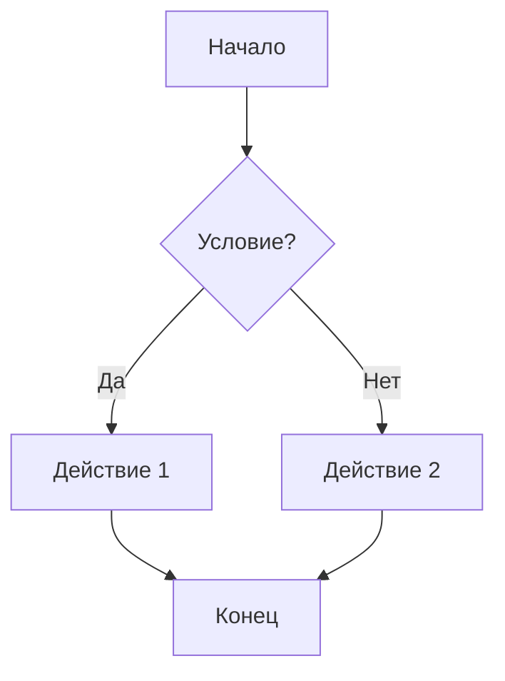

## 2. Flowchart — направление слева направо

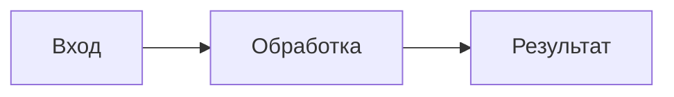

## 3. Flowchart — все основные формы узлов

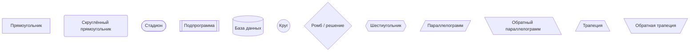

## 4. Flowchart — связи и стрелки

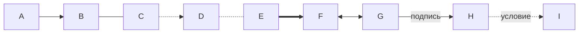

## 5. Flowchart — подграфы

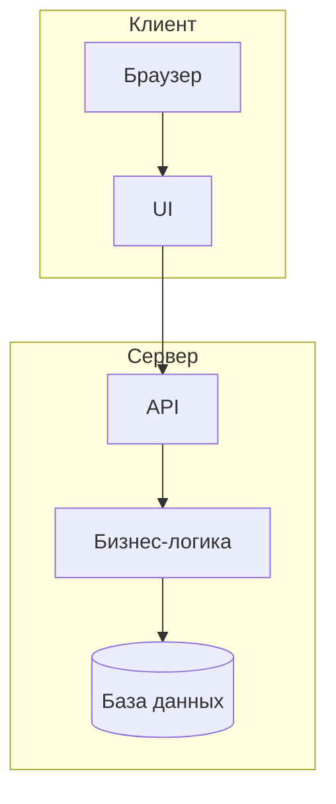

## 6. Flowchart — стили

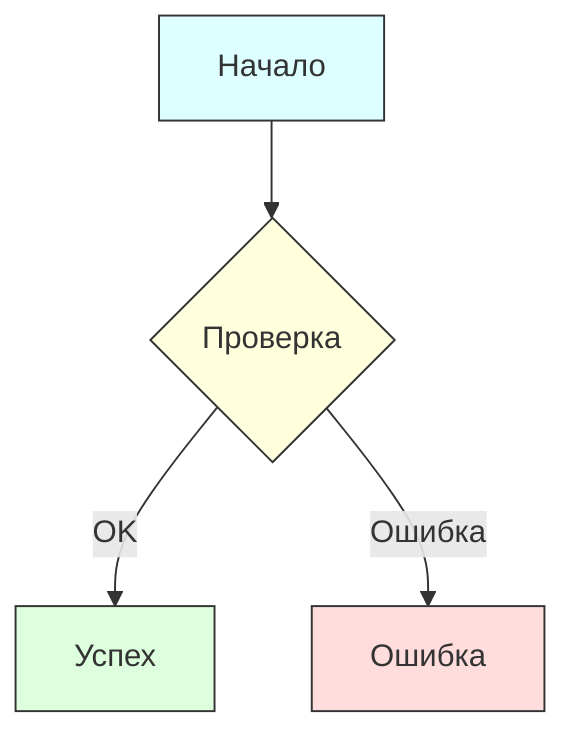

## 7. Flowchart — цикл

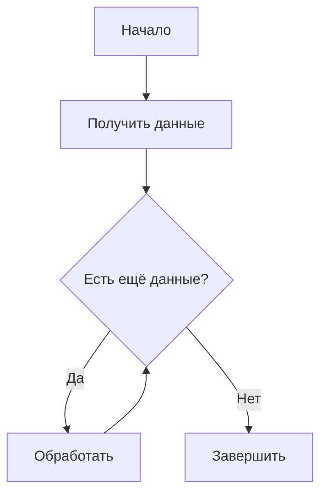

---

# 8. Sequence Diagram — последовательность сообщений

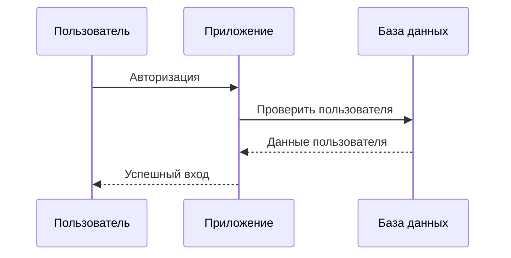

## 9. Sequence Diagram — активация

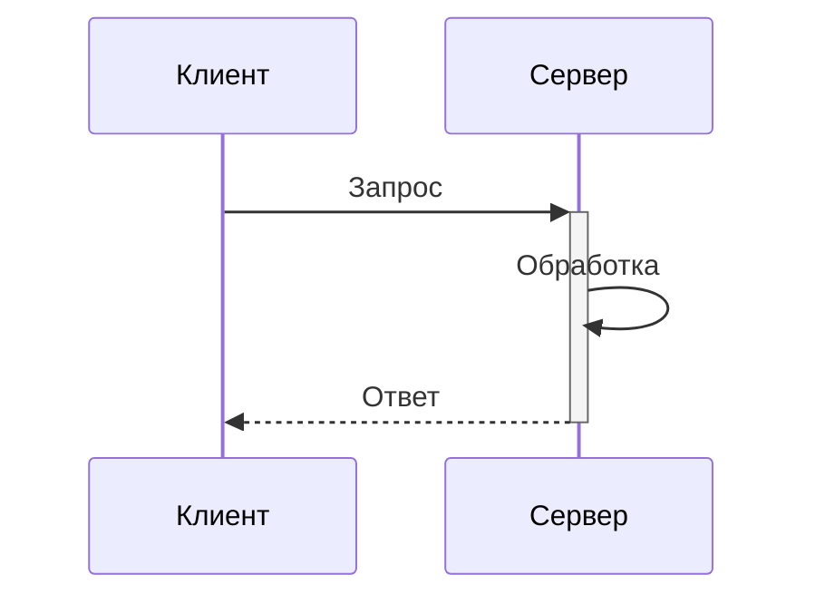

## 10. Sequence Diagram — условия

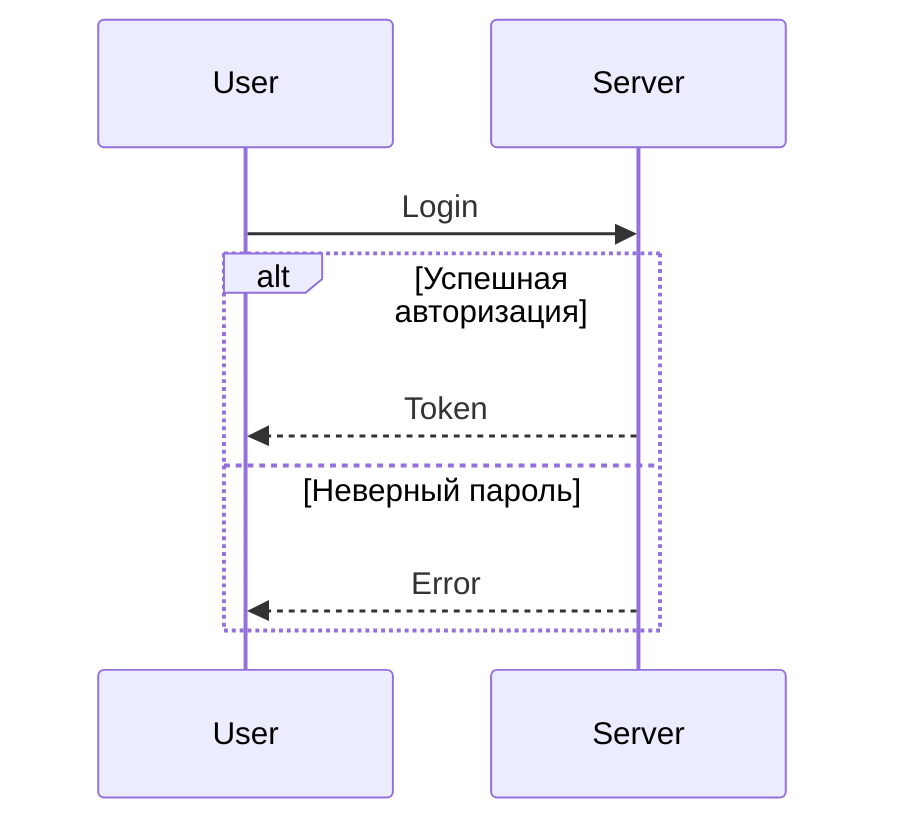

## 11. Sequence Diagram — цикл

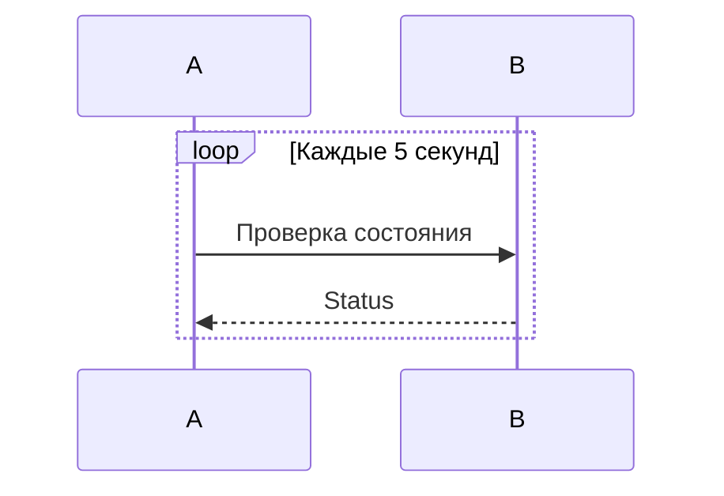

## 12. Sequence Diagram — параллельные действия

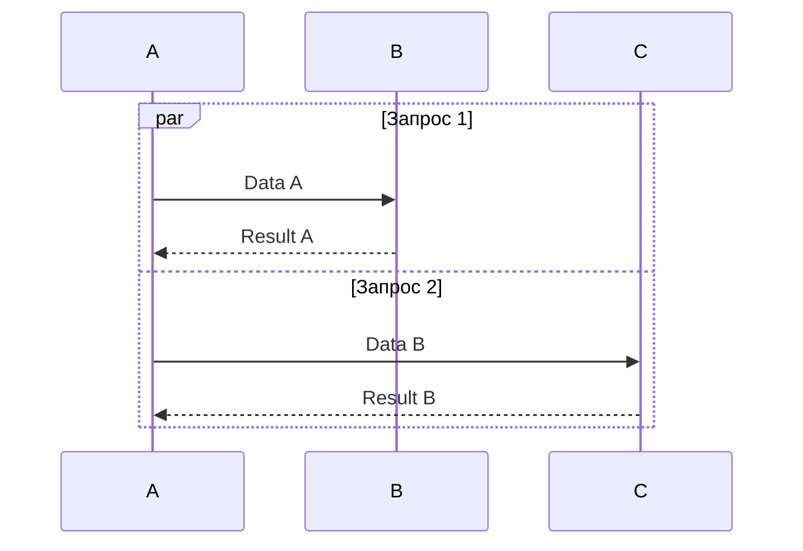

---

# 13. Class Diagram — классы

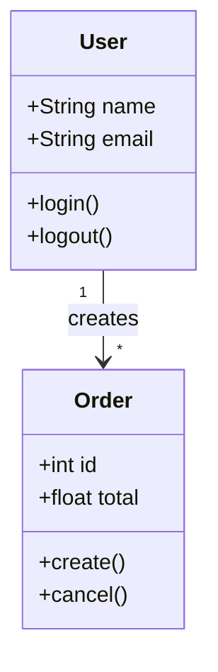

## 14. Class Diagram — наследование

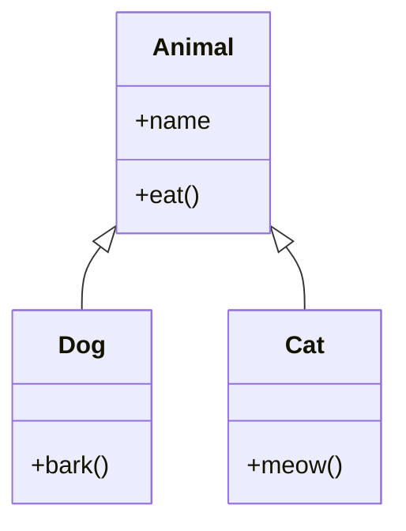

## 15. Class Diagram — интерфейс

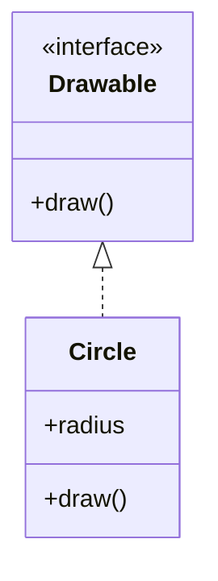

---

# 16. State Diagram — состояния

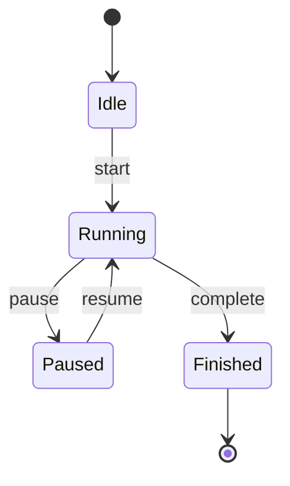

## 17. State Diagram — составное состояние

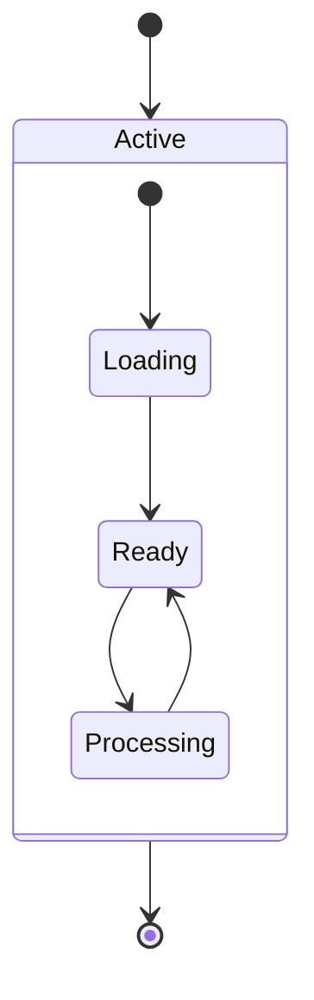

---

# 18. ER Diagram — база данных

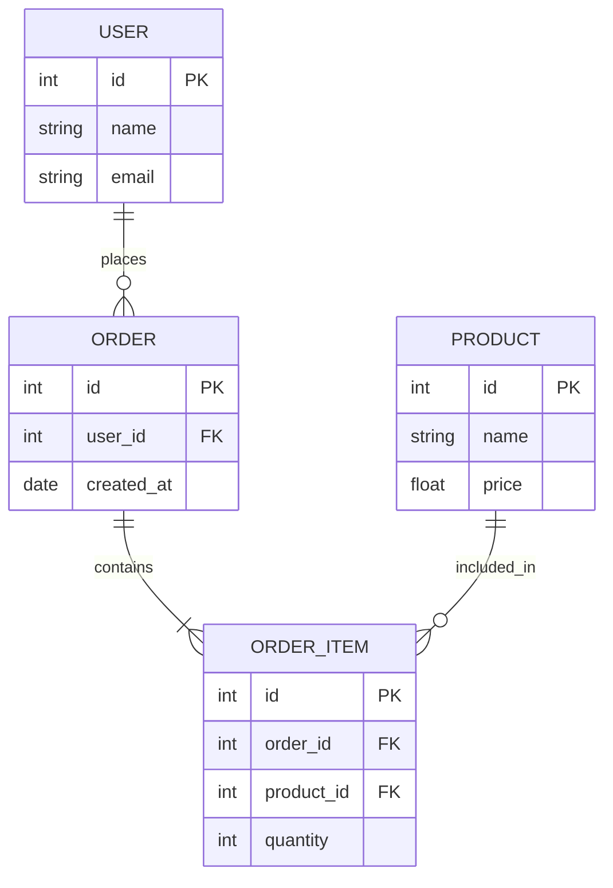

---

# 19. Gantt Chart — план проекта

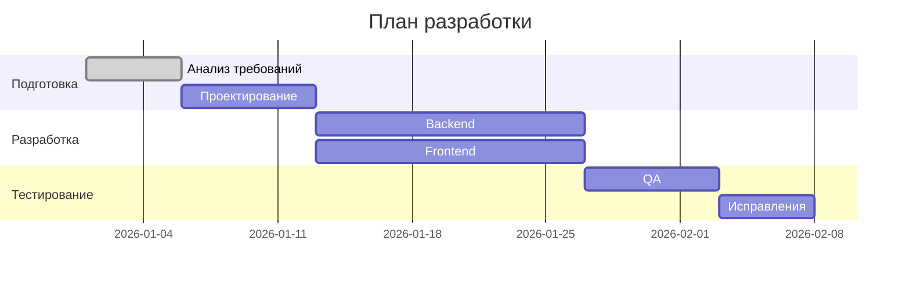

---

# 20. Pie Chart — круговая диаграмма

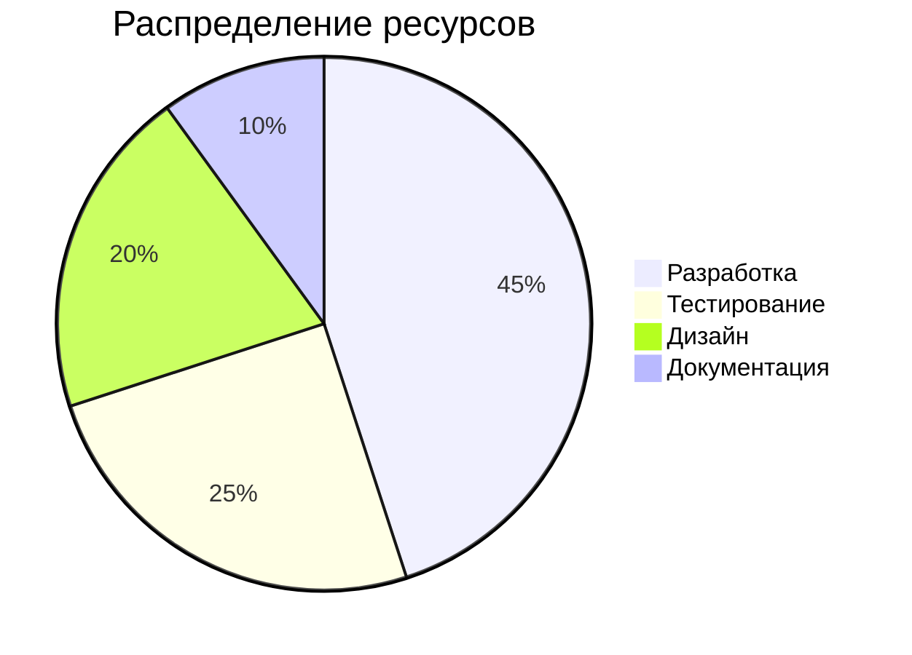

---

# 21. Requirement Diagram — требования

```mermaid
requirementDiagram
    requirement R1 {
        id: 1
        text: Система должна поддерживать авторизацию
        risk: high
        verifymethod: test
    }

    element E1 {
        type: system
        docref: AUTH
    }

    R1 - verifies -> E1
```

---

# 22. Git Graph — история веток

```mermaid
gitGraph
    commit id: "Initial"
    commit id: "Feature A"
    branch develop
    checkout develop
    commit id: "Dev A"
    commit id: "Dev B"
    checkout main
    merge develop
    commit id: "Release"
```

---

# 23. User Journey — путь пользователя

```mermaid
journey
    title Путь пользователя
    section Регистрация
      Открывает сайт: 5: User
      Заполняет форму: 4: User
      Подтверждает email: 3: User

    section Использование
      Входит в аккаунт: 5: User
      Создаёт проект: 5: User
      Получает результат: 5: User
```

---

# 24. Mindmap — интеллект-карта

```mermaid
mindmap
  root((Проект))
    Идея
      Цель
      Аудитория
    Дизайн
      UI
      UX
      Графика
    Разработка
      Frontend
      Backend
      Database
    Тестирование
      Unit
      Integration
      QA
```

---

# 25. Timeline — временная шкала

```mermaid
timeline
    title История проекта

    2026 : Идея
         : Исследование
    2027 : Прототип
         : Альфа
    2028 : Бета
         : Релиз
```

---

# 26. Quadrant Chart — квадрант

```mermaid
quadrantChart
    title Приоритет задач
    x-axis Низкая сложность --> Высокая сложность
    y-axis Низкая ценность --> Высокая ценность

    "Задача A": [0.2, 0.8]
    "Задача B": [0.8, 0.9]
    "Задача C": [0.4, 0.3]
    "Задача D": [0.9, 0.2]
```

---

# 27. XY Chart — столбчатая диаграмма

```mermaid
xychart-beta
    title "Продажи по месяцам"
    x-axis [Янв, Фев, Мар, Апр, Май]
    y-axis "Продажи" 0 --> 100
    bar [30, 45, 60, 55, 80]
```

## 28. XY Chart — линия

```mermaid
xychart-beta
    title "Рост показателя"
    x-axis [1, 2, 3, 4, 5]
    y-axis "Значение" 0 --> 100
    line [10, 25, 30, 55, 90]
```

---

# 29. Sankey Diagram — потоки

```mermaid
sankey-beta

A,Сайт,100
Сайт,Регистрация,40
Сайт,Просмотр,60
Регистрация,Покупка,25
Регистрация,Отказ,15
Просмотр,Покупка,20
Просмотр,Отказ,40
```

---

# 30. Block Diagram — блоки системы

```mermaid
block-beta
    columns 3

    A["Frontend"]
    B["API"]
    C["Database"]

    A --> B
    B --> C
```

## 31. Block Diagram — сложная структура

```mermaid
block-beta
    columns 4

    A["Client"]
    space
    B["Gateway"]
    space

    C["Service A"]
    D["Service B"]
    E["Service C"]
    F["Database"]

    A --> B
    B --> C
    B --> D
    B --> E
    C --> F
    D --> F
    E --> F
```

---

# 32. Architecture Diagram — архитектура

```mermaid
architecture-beta
    group client(cloud)[Client]

    service browser(internet)[Browser] in client

    group server(server)[Server]

    service api(server)[API] in server
    service db(database)[Database] in server

    browser:R --> L:api
    api:R --> L:db
```

---

# 33. C4 Context Diagram — контекст системы

```mermaid
C4Context
    title Контекст системы

    Person(user, "Пользователь", "Использует приложение")
    System(app, "Приложение", "Основная система")
    System_Ext(payment, "Платёжная система", "Обрабатывает платежи")

    Rel(user, app, "Использует")
    Rel(app, payment, "Проводит оплату")
```

---

# 34. C4 Container Diagram

```mermaid
C4Container
    title Контейнеры приложения

    Person(user, "Пользователь")
    System_Boundary(app, "Приложение") {
        Container(web, "Web App", "HTML/JS", "Пользовательский интерфейс")
        Container(api, "API", "Node.js", "REST API")
        ContainerDb(db, "Database", "PostgreSQL", "Данные")
    }

    Rel(user, web, "Использует")
    Rel(web, api, "Запрашивает")
    Rel(api, db, "Читает и записывает")
```

---

# 35. Packet Diagram — структура данных

```mermaid
packet-beta
    0-7: "Header"
    8-15: "Type"
    16-31: "Length"
    32-63: "Payload"
```

---

# 36. Kanban-style flowchart

```mermaid
flowchart LR
    subgraph TODO["To Do"]
        A[Задача 1]
        B[Задача 2]
    end

    subgraph PROGRESS["In Progress"]
        C[Задача 3]
    end

    subgraph DONE["Done"]
        D[Задача 4]
    end

    B --> C --> D
```

---

# 37. Диаграмма процесса с несколькими решениями

```mermaid
flowchart TD
    A([Старт]) --> B[Получить запрос]
    B --> C{Авторизован?}

    C -->|Нет| D[Показать Login]
    D --> E{Авторизация успешна?}
    E -->|Нет| F[Ошибка]
    F --> D
    E -->|Да| G[Продолжить]

    C -->|Да| G

    G --> H{Данные валидны?}
    H -->|Да| I[Выполнить операцию]
    H -->|Нет| J[Вернуть ошибку]

    I --> K([Конец])
    J --> K
```

---

# 38. Полный пример архитектуры приложения

```mermaid
flowchart TB
    User([Пользователь])

    subgraph Frontend["Frontend"]
        UI[Интерфейс]
        State[Состояние приложения]
    end

    subgraph Backend["Backend"]
        API[REST API]
        Auth[Авторизация]
        Logic[Бизнес-логика]
    end

    subgraph Storage["Storage"]
        DB[(PostgreSQL)]
        Cache[(Redis)]
    end

    User --> UI
    UI <--> State
    UI --> API
    API --> Auth
    API --> Logic
    Logic --> DB
    Logic --> Cache
```

---

# 39. Пример пользовательского процесса

```mermaid
flowchart LR
    Start([Начало])
    Login[Вход]
    Dashboard[Главная]
    Create[Создать объект]
    Edit[Редактировать]
    Save[Сохранить]
    Finish([Готово])

    Start --> Login --> Dashboard
    Dashboard --> Create --> Edit --> Save --> Finish
```

---

# 40. Пример игровой логики

```mermaid
stateDiagram-v2
    [*] --> MainMenu

    MainMenu --> Playing : Start
    MainMenu --> Settings : Settings
    Settings --> MainMenu : Back

    Playing --> Paused : Pause
    Paused --> Playing : Resume

    Playing --> GameOver : Player dies
    GameOver --> MainMenu : Main menu
    GameOver --> Playing : Retry

    Playing --> Victory : Goal reached
    Victory --> MainMenu : Continue
```

---

# 41. Пример API sequence

```mermaid
sequenceDiagram
    actor Client
    participant API
    participant Auth
    participant DB

    Client->>API: POST /login
    API->>Auth: Проверить credentials
    Auth->>DB: SELECT user
    DB-->>Auth: User
    Auth-->>API: JWT
    API-->>Client: 200 OK + JWT

    Client->>API: GET /profile
    API->>Auth: Validate JWT
    Auth-->>API: Valid
    API->>DB: SELECT profile
    DB-->>API: Profile
    API-->>Client: 200 OK
```

---

# 42. Пример ER-схемы интернет-магазина

```mermaid
erDiagram
    CUSTOMER ||--o{ ORDER : makes
    ORDER ||--|{ ORDER_ITEM : contains
    PRODUCT ||--o{ ORDER_ITEM : appears_in
    CATEGORY ||--o{ PRODUCT : contains
    CUSTOMER ||--o{ ADDRESS : has

    CUSTOMER {
        int id PK
        string name
        string email
    }

    ADDRESS {
        int id PK
        int customer_id FK
        string city
        string street
    }

    ORDER {
        int id PK
        int customer_id FK
        date order_date
        decimal total
    }

    ORDER_ITEM {
        int id PK
        int order_id FK
        int product_id FK
        int quantity
        decimal price
    }

    PRODUCT {
        int id PK
        int category_id FK
        string name
        decimal price
    }

    CATEGORY {
        int id PK
        string name
    }
```

---

# 43. Как выбрать тип Mermaid

| Задача | Тип |
|---|---|
| Алгоритм / процесс | `flowchart` |
| Обмен сообщениями | `sequenceDiagram` |
| Состояния объекта | `stateDiagram-v2` |
| Структура классов | `classDiagram` |
| База данных | `erDiagram` |
| План по времени | `gantt` |
| Доли | `pie` |
| Временная история | `timeline` |
| Интеллект-карта | `mindmap` |
| Приоритеты по двум осям | `quadrantChart` |
| Потоки ресурсов | `sankey-beta` |
| Архитектура блоками | `block-beta` |
| Инфраструктура | `architecture-beta` |
| C4-архитектура | `C4Context`, `C4Container` |
| История Git | `gitGraph` |
| Путь пользователя | `journey` |
| График | `xychart-beta` |
| Структура пакета | `packet-beta` |
| Требования | `requirementDiagram` |

---

## 44. Мини-шаблон для быстрого создания

```mermaid
flowchart TD
    A[Начало] --> B{Условие}
    B -->|Да| C[Действие]
    B -->|Нет| D[Альтернативное действие]
    C --> E[Конец]
    D --> E
```

## 45. Пустой шаблон Sequence

```mermaid
sequenceDiagram
    participant A as Участник A
    participant B as Участник B

    A->>B: Сообщение
    B-->>A: Ответ
```

## 46. Пустой шаблон State

```mermaid
stateDiagram-v2
    [*] --> State1
    State1 --> State2 : event
    State2 --> [*]
```

## 47. Пустой шаблон ER

```mermaid
erDiagram
    ENTITY_A ||--o{ ENTITY_B : relation

    ENTITY_A {
        int id PK
    }

    ENTITY_B {
        int id PK
        int entity_a_id FK
    }
```

---

## Примечание

Mermaid развивается, поэтому список доступных диаграмм зависит от версии Mermaid и конкретного Markdown-редактора. Особенно это относится к экспериментальным типам с суффиксом `-beta` и к некоторым C4/архитектурным возможностям.
